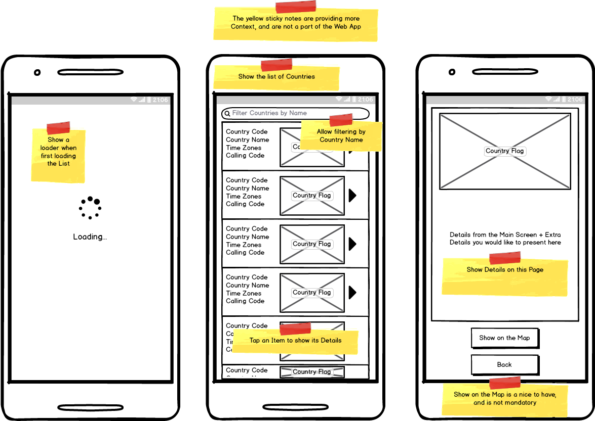

# lambdaS Coding Challenge 🛠

## Purpose

Hi and welcome to the lambdaS Coding Challenge. The purpose of this task is to get a sense for your technical ability and how you work with tools that are similar to what we currently use at lambdaS.

We want to see how well you build software and we are looking forward to chatting with you about your solution afterwards. We recommend you have a good look at the problem description before getting started.

We ask that you work on the solution by yourself and submit only your own code. This task shouldn’t take excessive time from your schedule, however we know people have busy weeks and if you need a weekend to work on this we understand.

When complete, please open a PR (Pull Request) from a newly created **develop** branch back to the **master** branch. We will review your implementation with you during a follow-up session.

## The Task

You are required to build a responsive web app (mobile | tablet | desktop) which will load a list of contries from an API and present them to Users, as illustrated in the following wireframe:



---

You can use any frameworks or libraries suitable for the task. You might be asked why you made certain choices during interview.

Don't worry if you feel as though some of this task is vague, it's been written that way intentionally so that you have the freedom to approach the task however you want.

## Country API End Point and Example

API End Point: <https://restcountries.eu/rest/v2/all>

Example Response:

```json
[
   {
      "name":"Afghanistan",
      "topLevelDomain":[
         ".af"
      ],
      "alpha2Code":"AF",
      "alpha3Code":"AFG",
      "callingCodes":[
         "93"
      ],
      "capital":"Kabul",
      "altSpellings":[
         "AF",
         "Afġānistān"
      ],
      "region":"Asia",
      "subregion":"Southern Asia",
      "population":27657145,
      "latlng":[
         33.0,
         65.0
      ],
      "demonym":"Afghan",
      "area":652230.0,
      "gini":27.8,
      "timezones":[
         "UTC+04:30"
      ],
      "borders":[
         "IRN",
         "PAK",
         "TKM",
         "UZB",
         "TJK",
         "CHN"
      ],
      "nativeName":"افغانستان",
      "numericCode":"004",
      "currencies":[
         {
            "code":"AFN",
            "name":"Afghan afghani",
            "symbol":"؋"
         }
      ],
      "languages":[
         {
            "iso639_1":"ps",
            "iso639_2":"pus",
            "name":"Pashto",
            "nativeName":"پښتو"
         },
         {
            "iso639_1":"uz",
            "iso639_2":"uzb",
            "name":"Uzbek",
            "nativeName":"Oʻzbek"
         },
         {
            "iso639_1":"tk",
            "iso639_2":"tuk",
            "name":"Turkmen",
            "nativeName":"Türkmen"
         }
      ],
      "translations":{
         "de":"Afghanistan",
         "es":"Afganistán",
         "fr":"Afghanistan",
         "ja":"アフガニスタン",
         "it":"Afghanistan",
         "br":"Afeganistão",
         "pt":"Afeganistão",
         "nl":"Afghanistan",
         "hr":"Afganistan",
         "fa":"افغانستان"
      },
      "flag":"https://restcountries.eu/data/afg.svg",
      "regionalBlocs":[
         {
            "acronym":"SAARC",
            "name":"South Asian Association for Regional Cooperation",
            "otherAcronyms":[

            ],
            "otherNames":[

            ]
         }
      ],
      "cioc":"AFG"
   },
   {
     ...
   }
]
```

## Tips

- We expect the submission to represent your view of production code
- Commit regularly
- README file with instructions how to run / test the Project
- Please provide potential assumptions you had to make during development

Your assignment will be marked based on following criteria:

- Design
- Code Style
- Unit Testing
- Complexity / Effort put in the Project

Extra Points:

- Latest Language features
- State Management
- Handle API failures
- Handle no network connectivity (caching)
- Attractive UI (animations etc)
- TypeScript
- PWA (Progressive Web App)

## Help

Having questions is normal! Feel free to reach out by creating an issue in GitHub repo if you have any questions, we'll do our best to get back to you ASAP!

## Good Luck
